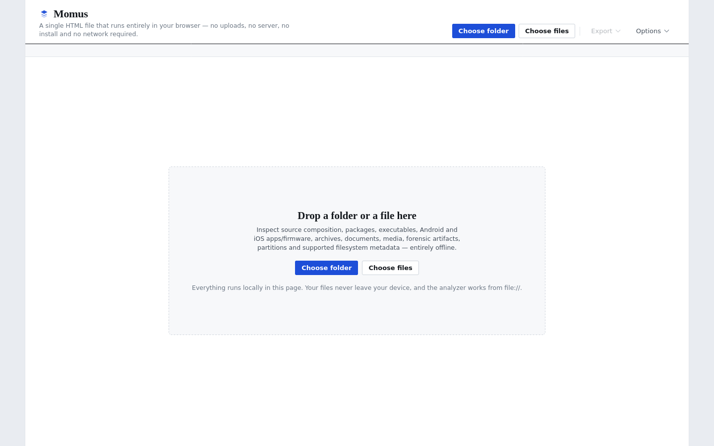
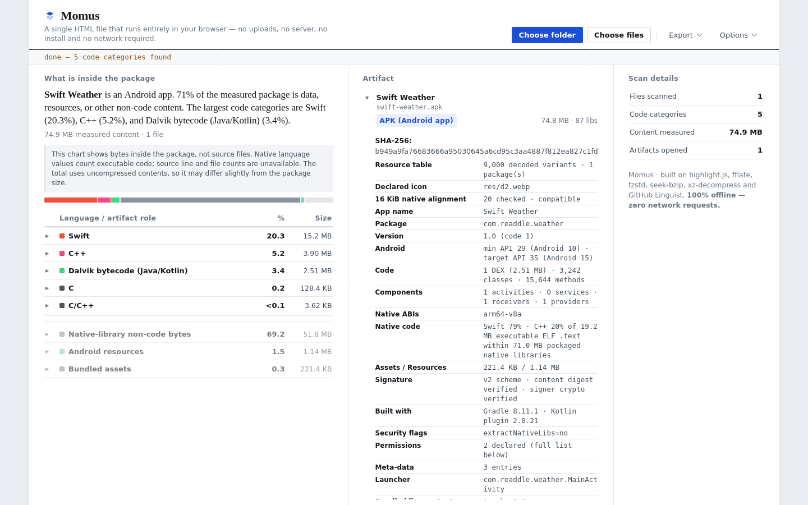

# Momus

## See what is really inside your files.

Momus is an offline code and binary analyzer packed into a single HTML file. It can scan a project folder, open supported packages and executables, inspect documents, and show a readable breakdown of the results.

**[Open Momus in your browser](https://kaklaber.github.io/Momus/)**

No account, installation, server, or file upload is needed. The analyzer runs locally in your browser and makes no analysis requests over the network.

## Screenshots

### Start screen

### Android package analysis

## More than a language counter

Most language counters rely heavily on filenames and extensions. That works for simple repositories, but it misses a lot:

- One HTML file may contain HTML, CSS, JavaScript, templates, and PHP.
- An APK may contain DEX bytecode, native libraries, resources, certificates, SDKs, and debug information.
- A package or executable can reveal dependencies and security details that never appear in a repository language bar.

Momus reads the contents of supported files instead of stopping at the extension. The goal is simple: give you a useful first look at what a project or artifact is actually made of.

## What it can do

- Break down code by bytes, lines, or file count.
- Split mixed files such as HTML, PHP, Vue, Svelte, Astro, ERB, EJS, JSP, and Markdown code blocks.
- Inspect application packages, archives, native binaries, managed assemblies, and debug symbols.
- Report dependencies, libraries, permissions, signatures, build metadata, and binary hardening.
- Find URLs, masked secret candidates, dynamic execution, dangerous APIs, WebView bridges, and suspicious configuration.
- Read CycloneDX and SPDX SBOMs, Terraform state, Helm charts, Homebrew metadata, and common dependency files.
- Analyze PDF structure and recovered text, subtitle timing, text encoding, and structured data.
- Show a quick package index for large APKs while deeper CPU-only analysis continues.

## Format coverage

This is not a complete list, but it covers the main areas Momus currently understands.

| Area | Examples |
|---|---|
| Android and mobile | APK, AAB, APKS/XAPK, DEX, Android resources and manifests, FileProvider paths, app shortcuts, Flutter/native payloads, IPA |
| Native and managed code | PE/EXE/DLL, ELF, Mach-O, CLR metadata and IL, DWARF, PDB, dSYM, imports, libraries, and hardening |
| Web and runtimes | JavaScript bundles, source maps, packaged web apps, Hermes metadata, WebAssembly and component-model structures |
| Packages and archives | JAR, AAR, WAR, DEB, IPK, Python wheels, NuGet, Homebrew bottles, TAR, ZIP, and other common containers |
| Supply chain and infrastructure | CycloneDX, SPDX, Terraform state, Helm charts, dependency manifests, and lockfiles |
| Documents and data | PDF, SRT, VTT, text, CSV, JSON, XML, HDF5, Arrow, LMDB, and CRAM |
| Smart contracts | Solidity compiler artifacts and raw EVM bytecode |

## Use Momus

### Online

Open **[kaklaber.github.io/Momus](https://kaklaber.github.io/Momus/)**, then choose a folder or individual files. GitHub Pages serves `index.html`, but the files you select stay on your device.

### Local and offline

1. Download `index.html`.
2. Open it in Firefox, Chrome, or Edge.
3. Choose a folder or select files.
4. Explore the language and artifact reports.

Folder selection depends on browser support. Individual file selection is available when folder picking is not.

## A note about the results

Momus performs static analysis. It does not run applications, scripts, bytecode, macros, or extracted files.

Security findings are clues, not verdicts. A detected API, URL, token shape, or opcode does not prove that the behavior is reachable or harmful. Secret candidates are masked, but false positives are still possible.

Packaged-code percentages are also different from repository source-language percentages. For example, a native runtime may add many megabytes to an APK even if the original project contains relatively little native source code.

Some advanced parsers are intentionally bounded. Momus is not a full decompiler, debugger, antivirus, or malware sandbox. It reports these limits instead of presenting partial evidence as certainty.

## Third-party components

Momus includes open-source libraries and data such as highlight.js, fflate, fzstd, seek-bzip, xz-decompress, and GitHub Linguist data. Their copyright and license notices remain in `index.html`, and those components stay under their respective licenses.

## License

The original Momus project code is available under the [MIT License](LICENSE). Bundled third-party components remain subject to their own licenses.
